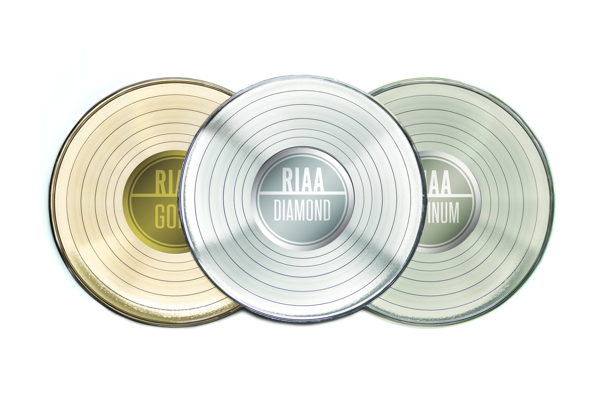
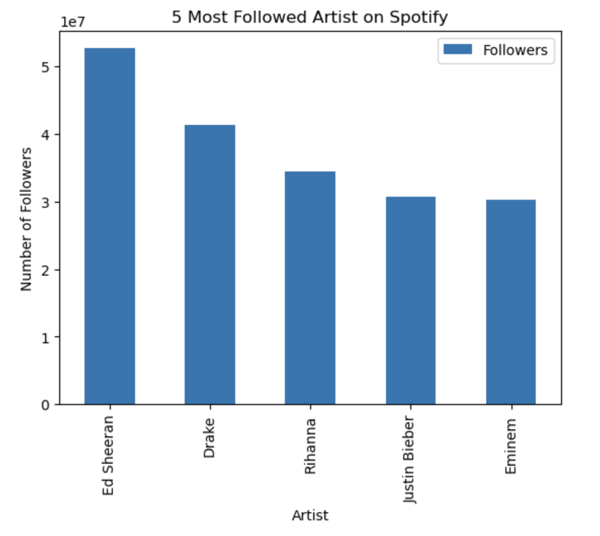
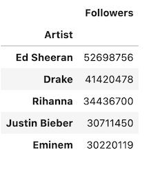
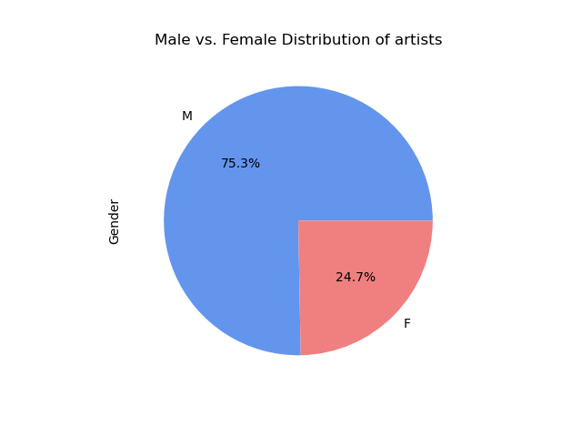
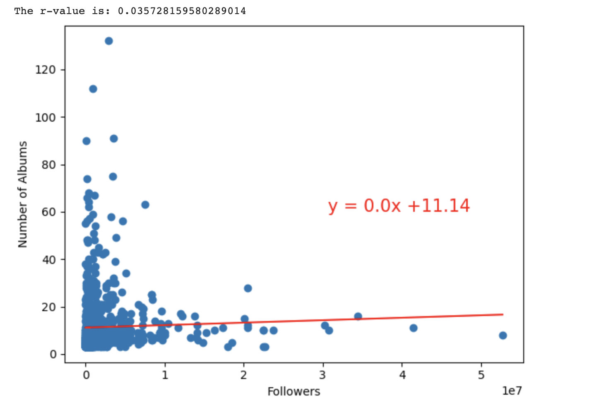
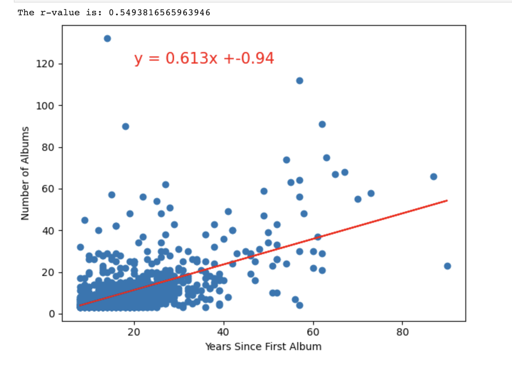
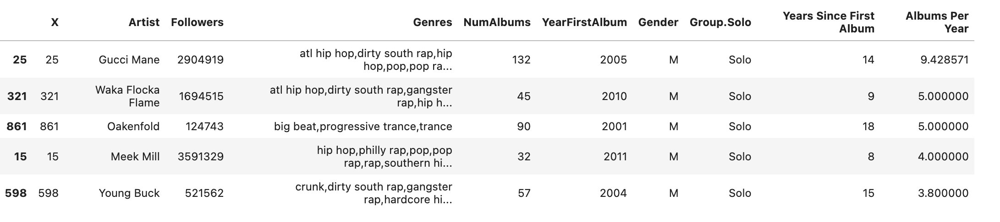
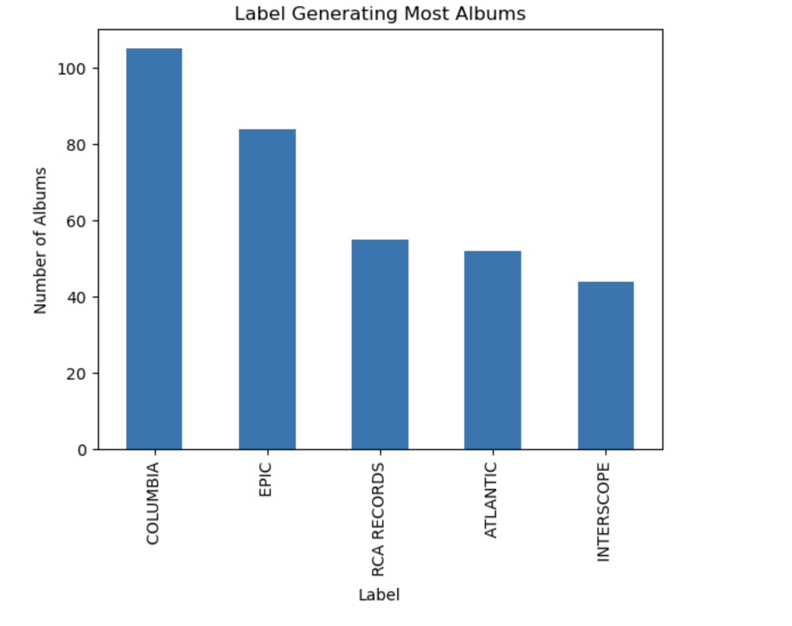
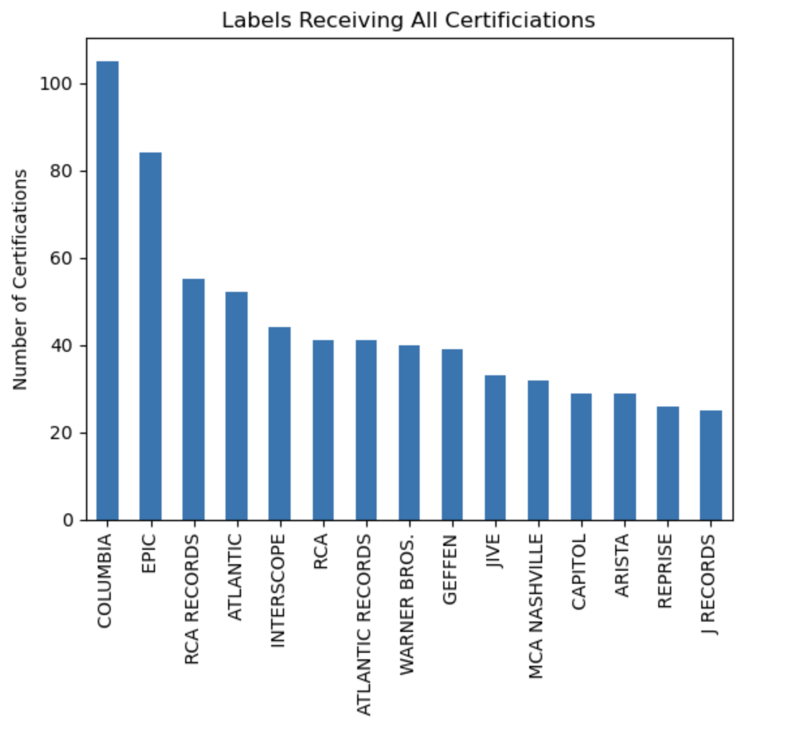
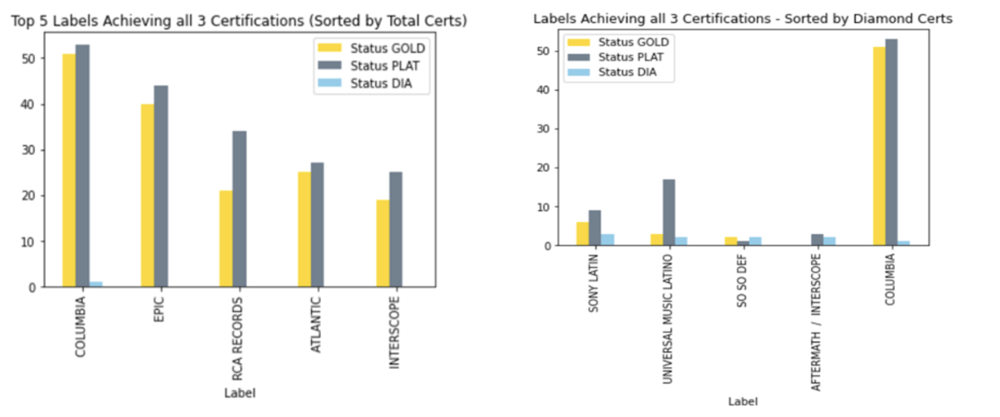

# Project-1

**Billboard Charting Artists with RIAA Certifications**

**Project Description**:

This project investigates trends in top billboard charting artists from July 1999 to July 2019 in order to help define and predict possible success factors for record labels and emerging artists.

**Project Team Members**:

Ruth Ashaolu, Kieran Taylor, Sarah Peterson, PJ Gill, and Nicole Bustamante

**Description of data**:
our data was obtained from: https://www.kaggle.com/datasets/danield2255/data-on-songs-from-billboard-19992019

- artistDf.csv: 
"Data on tenured Billboard artists who appeared on billboard between July 1999 and July 2019, released at least 3 albums, and released their first album no later than 2012. These are artists to be considered tenured popular artists. The file has demographic, genre, and history data on them"

- riaaAlbumCerts_1999-2019.csv:
"RIAA certifications given to albums released between July 1999 and July 2019"

**Research Questions**:

    1. Who are the 5 most followed artists on Spotify?
    

    2. What Artist has the most albums?
.png)

    3. Which Artist released the first album?

    4. Female/male artists – break down number of albums by gender?

    5. Group/solo  – break down

    6a. Summary statistics for followers and number of albums

    
    6b. Statistics for correlations and linear regression:
correlation and regression for number of albums and followers

correlation and regression for number of albums and years since first album

    6c. Statistics for which artists produced most albums per year

    7. What Label generated the most albums?

    8. Which Artists have achieved Diamond status?

    9. Which Labels have achieved Diamond status?

    10. Which Artists have acheived Platinum status?

    10. Which Labels have acheived Platinum status?

    10. Which Artists have acheived Gold status?

    11. Which Labels have achieved Gold status?

    12. Which Labels have achieved all 3 statuses?

(Breakdown by Label and Certification)

    13. What were the most popular Genres?

**Final Summary and Analysis**:

After looking at general trends in the data sets and addressing our research questions, we found that there are several factors that may help predict the success of artists and record labels. Our analysis helped us identify artists who showed overall success in their careers and may therefore be role models for up and coming musicians. Ed Sheeran was the most followed artist on spotify, Gucci Mane produced the most albums, and Gene Autry released the first album in the dataset in 1929. Gucci Mane also has put out the most albums per year since the year of his first album.

Some overall trends in this data set indicate that the music industry is predominantly male solo artists. In terms of genre, ‘dance pop’ and ‘rap pop’ were the two most popular categories. The average number of albums artists put out was 11.3 and average number of followers was 1838602. There was weak positive correlation between number of albums and followers, but there was a stronger positive correlation between number of albums and years since first album. This may indicate that the longer an artist has been putting out albums, the more albums they generate which could contribute to greater sales and success. 

The data illustrates that being signed to more prominent, long-standing record labels can be a defining factor of success for emerging artists. Record labels who produced more albums also received more certifications (diamond, platinum, gold). Columbia put out the most albums. Certifications may also indicate success for artists and labels. The top artist achieving Diamond was Shakira and the top label was Sony Latin. The top achieving artist for Platinum was Kenny Chesney and the label was Columbia. The top artist achieving Gold was Elvis Presley and the label was again, Columbia. Columbia by far received the most certifications for Diamond, Platinum, and Gold. The multibar chart is further breaks down the certifications for each label. 

